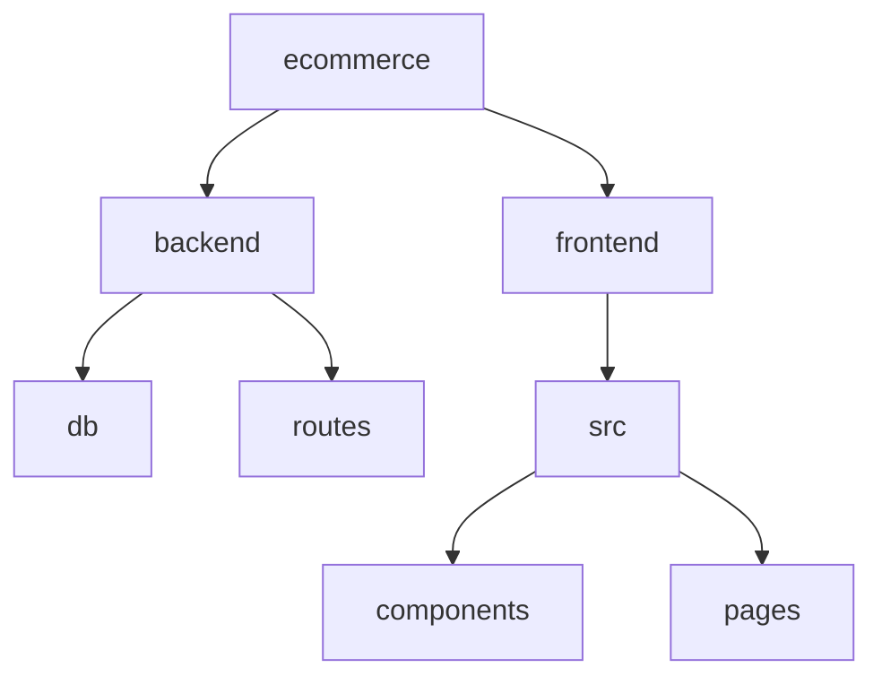

# Ecommerce Platform

## 🗂️ Description

The Ecommerce Platform is a full-stack application designed to facilitate online buying and selling of products. This project enables users to create accounts, browse products, add products to cart, and complete purchases. It also allows sellers to add, edit, and manage their products. The platform is built with a React-based frontend, an Express.js backend, and utilizes MongoDB for data storage.

The platform is designed for both buyers and sellers, providing an intuitive interface for users to interact with the application. The project aims to provide a seamless and secure ecommerce experience.

## ✨ Key Features

### **User Management**

* User registration and login functionality
* User profile management
* Authentication and authorization

### **Product Management**

* Add, edit, and delete products
* Product details page with images and description
* Product listing page with filtering and sorting

### **Cart and Checkout**

* Add products to cart
* View cart contents
* Update cart quantities
* Complete purchase

### **Seller Features**

* Add, edit, and manage products
* Verify email and password for product management

## 🗂️ Folder Structure



## 🛠️ Tech Stack


## ⚙️ Setup Instructions

### Prerequisites

* Node.js (version 16 or higher)
* MongoDB (version 5 or higher)
* Git

### Clone the Repository

```bash
git clone https://github.com/oneWritesCode/ecommerce.git
```

### Install Dependencies

```bash
cd ecommerce/backend
npm install

cd ../frontend
npm install
```

### Start the Application

```bash
cd ecommerce/backend
npm run start

cd ../frontend
npm run dev
```

## 🚀 GitHub Actions

The repository uses GitHub Actions for continuous integration and deployment. The workflow is defined in the `.github/workflows/main.yml` file.

## 📁 API Endpoints

The backend API endpoints are defined in the `backend/routes` directory. The main endpoints include:

* `/api/user`: User registration and login
* `/api/product`: Product management
* `/api/cart`: Cart management

## 🤝 Code Quality

The codebase follows standard professional guidelines for code quality, including:

* ESLint configuration for code linting
* TypeScript for type checking
* Modular and reusable code components

## 📝 Documentation

The codebase includes detailed documentation for each component and module. The documentation is generated using standard formatting conventions and includes information on usage, props, and state.


<br><br>
<div align="center">

<h3>deepak</h3>
<p>Software enthusiast, striving for excellence in code.</p>
</div>
<br>
<p align="right">
  <a href="https://gitfull.vercel.app">Made by GitFull</a>
</p>
    